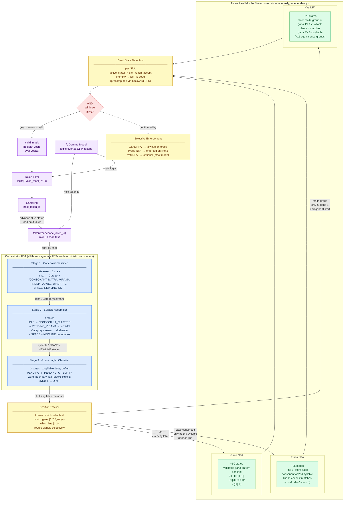

# NFA Constrained Decoding — Full Architecture

End-to-end architecture from Gemma token stream to valid token mask,
showing the three FST stages and three parallel NFA streams.

---

## Overview

The system intercepts Gemma's generation process at each decoding step and
masks out any token that would violate Telugu Dwipada metre. It does this by
maintaining a set of finite automata that track the metrical state of the poem
being generated in real time.

The architecture has two layers:

**Layer 1 — The Orchestrator (three chained FSTs)**

Before any metrical judgement can be made, each raw Gemma token (a variable-
length Unicode string) must be reduced to a stream of classified syllables with
U/I labels. This is a pure data transformation — no acceptance or rejection —
so it is implemented as a pipeline of three Finite State Transducers (FSTs):

1. **Codepoint Classifier** — stateless; maps each Unicode character to a
   linguistic category (CONSONANT, MATRA, VIRAMA, DIACRITIC, SPACE, etc.).
   Takes raw text, produces a typed character stream.

2. **Syllable Assembler** — 4 states; groups the typed character stream into
   complete aksharalu (syllables). Handles conjuncts (C + ్ + C), trailing
   virama (pollu) merge, independent vowels, and SPACE/NEWLINE boundaries.
   Produces a syllable stream.

3. **Guru/Laghu Classifier** — 3 states with a 1-syllable delay buffer;
   classifies each syllable as Guru (U) or Laghu (I). Applies all six
   classification rules including Rule 5 (syllable before a conjunct becomes
   Guru) with word-boundary awareness (a SPACE between syllables blocks Rule 5).
   Produces a U/I stream.

**Layer 2 — The Position Tracker and Three Parallel NFAs**

Once syllables are labelled U or I, the Position Tracker knows exactly where
in the dwipada structure each syllable falls (which gana, which line). It
routes three different signals to three independent NFAs running in parallel:

- **Gana NFA** (~60 states) — validates the metrical gana pattern of each
  line. Each line must be exactly three Indra ganas followed by one Surya gana:
  `(IIII|IIIU|IIUI|UII|UIU|UUI)³ · (III|UI)`. This NFA is non-deterministic
  because after seeing the first syllable of a gana (e.g., "I"), multiple gana
  types remain possible simultaneously. It receives a U/I signal for every
  syllable.

- **Prasa NFA** (~35 states) — enforces the rhyme constraint. It records the
  base consonant class of the 2nd syllable of line 1, then verifies that the
  2nd syllable of line 2 shares the same consonant class (with equivalences:
  ల↔ళ, శ↔స, ఱ↔ర). It only receives a signal at the 2nd syllable of each line.

- **Yati NFA** (~28 states) — enforces the alliteration constraint. It records
  the maitri group of the 1st syllable of gana 1, then verifies that the 1st
  syllable of gana 3 belongs to the same maitri group (~11 equivalence classes).
  It only receives a signal at the start of gana 1 and gana 3.

All three NFAs run on the same syllable stream but consume different projections
of it at different positions. After each token, each NFA's active state set is
pruned against a precomputed co-reachability set (states that can still reach
an accept state). If any NFA's active set becomes empty, the token is invalid.

**The Mask**

At each generation step, before sampling, the system computes a boolean mask
over all 262,144 vocabulary tokens. A token is valid only if feeding its
Unicode characters through all three stages leaves all three NFAs alive. Invalid
tokens are set to −∞ logits so Gemma can never sample them. The result is a
model that generates Telugu text constrained to valid Dwipada metre at every
single token step.

---

---



---

## Signal Routing Summary

The Position Tracker is the router — it knows exactly which syllable of which
gana of which line is being processed, and selectively forwards signals:

| Signal | From | To | When |
|--------|------|----|------|
| U / I marker | Guru/Laghu FST | **Gana NFA** | Every syllable |
| Base consonant class | Syllable metadata | **Prasa NFA** | 2nd syllable of line 1 and line 2 only |
| Maitri group | Syllable metadata | **Yati NFA** | 1st syllable of gana 1 and gana 3 only |

## Why Three Separate NFAs

The three NFAs consume **different projections** of the same syllable stream
at **different positions**. Keeping them separate gives:

- **Debuggability** — know which rule failed
- **Partial scoring** — gana 40%, prasa 35%, yati 25%
- **Selective enforcement** — enforce gana strictly, relax yati
- **Smaller state space** — 3 × ~40 states vs one product automaton of ~46,000

## Constrained Decoding Loop

```python
for each generation step:
    logits     = gemma.forward(input_ids)          # model output
    valid_mask = get_valid_tokens(nfa_states)       # AND of all 3 NFAs
    logits[~valid_mask] = float('-inf')             # kill invalid tokens
    next_token = sample(logits)                     # sample from valid only
    nfa_states = advance(nfa_states, next_token)    # update all 3 NFA states
```
