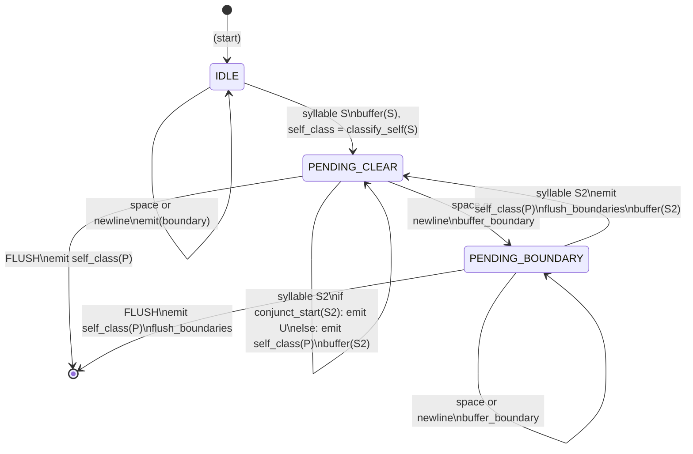
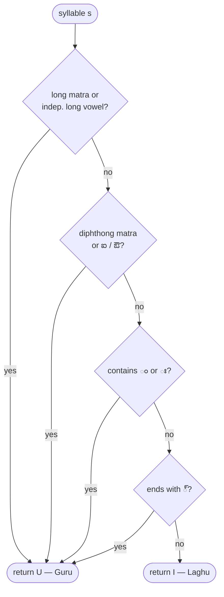
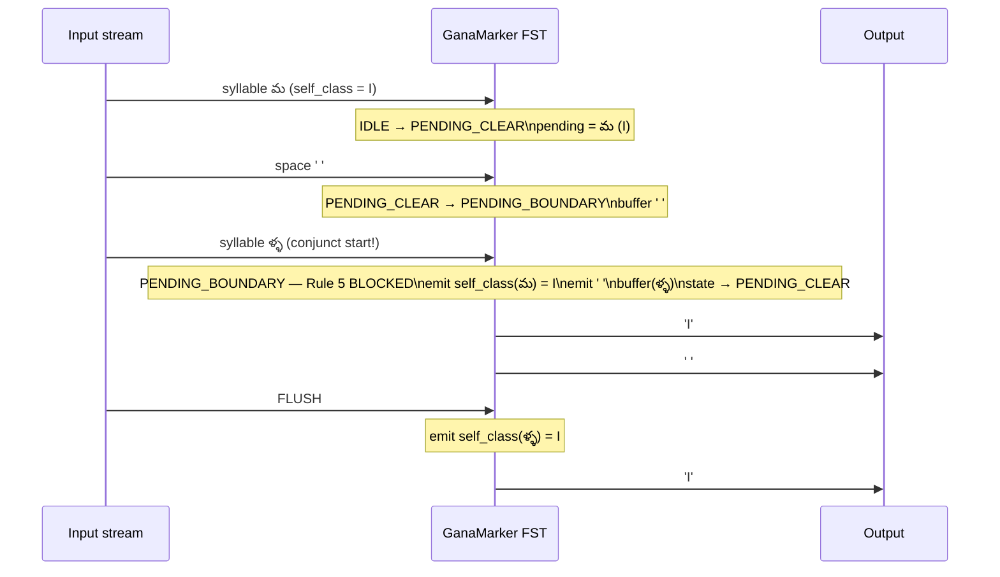

# Design: Ganana Marker FST

A Finite State Transducer (FST) that reads a stream of Telugu syllables
(aksharalu), spaces, and newlines — the output of the Syllable Assembler FST —
and emits a **Guru (U)** or **Laghu (I)** marker for each syllable, passing
boundaries through unchanged.

This is **Stage 2** of the NFA constrained-decoding pipeline for Telugu
Dwipada poetry.

---

## Purpose and Pipeline Position


The Syllable Assembler groups raw codepoints into syllable-sized chunks.
The Ganana Marker classifies each chunk as heavy (Guru) or light (Laghu)
using the 5 prosody rules from classical Telugu chandassu.

---

## The 5 Guru / Laghu Rules

Sourced from `src/dwipada/core/aksharanusarika.py :: akshara_ganavibhajana()`.

| Rule | Name (Telugu) | Condition | Example |
|------|--------------|-----------|---------|
| 1 | దీర్ఘ స్వరం (Long vowel) | Contains long matra ా ీ ూ ే ో ౌ ృ, or independent long vowel ఆ ఈ ఊ ౠ ఏ ఓ | రా=U, ఆ=U |
| 2 | సంధ్యక్షరం (Diphthong) | Contains diphthong matra ై ౌ, or independent ఐ ఔ | గై=U, ఐ=U |
| 3 | అనుస్వారం/విసర్గ | Contains anusvara ం or visarga ః | సం=U, దుః=U |
| 4 | పొల్లు హల్లు (Trailing virama) | Syllable ends with ్ (halant) | న్=U |
| 5 | సంధి (Sandhi lookahead) | NEXT syllable (same word) starts with conjunct/double C+్+C → current becomes U | స+త్య=U |

**If no rule applies:** Laghu (I). Default is the short inherent vowel (అ).

---

## Word Boundary and Line Boundary

Rule 5 must **not** cross word or line boundaries. Seeing a space (` `) or
newline (`\n`) between two syllables suppresses the sandhi effect.

```
Same word:     స  + త్య  →  స = U   (Rule 5 fires)
Across space:  స  +  ' ' + త్య  →  స = I   (Rule 5 blocked)
Across newline: స  + '\n' + త్య  →  స = I   (Rule 5 blocked)
```

Each new word and each new line begins **afresh** — no sandhi effect carries
over from the previous word or line.

---

## FST States



### Why 3 States Are Sufficient

The 1-syllable lookahead needed for Rule 5 is captured by keeping one syllable
in a "pending" buffer. The single bit of extra information needed — *has a
word/line boundary been seen since the pending syllable?* — is encoded as the
distinction between `PENDING_CLEAR` and `PENDING_BOUNDARY`. No stack or tape
is required.

---

## Full Transition Table

| From | Input | Action | Next state |
|------|-------|--------|------------|
| IDLE | syllable S | buffer(S); self_class = classify_self(S) | PENDING_CLEAR |
| IDLE | space / newline | emit(boundary) | IDLE |
| PENDING_CLEAR | syllable S2 | if conjunct_start(S2): **emit U** (Rule 5) else: emit self_class(P); buffer(S2); self_class = classify_self(S2) | PENDING_CLEAR |
| PENDING_CLEAR | space / newline | buffer_boundary | PENDING_BOUNDARY |
| PENDING_BOUNDARY | syllable S2 | emit self_class(P); emit_all_boundaries(); buffer(S2); self_class = classify_self(S2) | PENDING_CLEAR |
| PENDING_BOUNDARY | space / newline | buffer_boundary | PENDING_BOUNDARY |
| PENDING_CLEAR | FLUSH | emit self_class(P); emit_all_boundaries() | IDLE |
| PENDING_BOUNDARY | FLUSH | emit self_class(P); emit_all_boundaries() | IDLE |

---

## classify_self() — Rules 1–4 Flowchart



---

## Conjunct Start Detection

```python
is_conjunct_start(s) = (
    len(s) >= 3
    and s[0] in TELUGU_CONSONANTS
    and s[1] == '్'           # virama at index 1
    and s[2] in TELUGU_CONSONANTS
)
```

Covers:
- Distinct conjuncts: `స్క`, `త్య`, `స్త్రీ`
- Doubled consonants: `మ్మ`, `ళ్ళ`, `న్న`

---

## Word Boundary Suppression — Sequence Diagram



---

## Step-by-Step Trace: `"తనుమ ళ్ళరాస్తుంది"`

Expected markers (syllables only): `I I I I U U I`

```
Step | Input   | State Before     | Pending | Rule5 | State After      | Emitted
-----|---------|------------------|---------|-------|------------------|--------
1    | తు       | IDLE             | —       | —     | PENDING_CLEAR    | —
2    | ను       | PENDING_CLEAR    | తు=I    | no    | PENDING_CLEAR    | I
3    | మ        | PENDING_CLEAR    | ను=I    | no    | PENDING_CLEAR    | I
4    | ' '     | PENDING_CLEAR    | మ=I     | —     | PENDING_BOUNDARY | —
5    | ళ్ళ      | PENDING_BOUNDARY | మ=I     | BLOCK | PENDING_CLEAR    | I, ' '
6    | రా       | PENDING_CLEAR    | ళ్ళ=I   | no    | PENDING_CLEAR    | I
7    | స్తుం    | PENDING_CLEAR    | రా=U    | no    | PENDING_CLEAR    | U
8    | ది       | PENDING_CLEAR    | స్తుం=U | no    | PENDING_CLEAR    | U
FLUSH|         | PENDING_CLEAR    | ది=I    | —     | IDLE             | I
```

Output: `['I', 'I', 'I', ' ', 'I', 'U', 'U', 'I']`

Syllable markers (ignoring boundary): **I I I I U U I** ✓

---

## Step-by-Step Trace: Dwipada Couplet

Input:
```
సౌధాగ్రముల యందు సదనంబు లందు
వీధుల యందును వెఱవొప్ప నిలిచి
```

Line 1 syllables (approx): సౌ ధా గ్ర ము ల  యం దు  స ద నం బు  లం దు
Line 1 markers:             U  U  I  I  I  U  I   I  U I  U  I  U I

Line 2 syllables (approx): వీ ధు ల  యం దు ను  వె ఱ వొ ప్ప  న లి చి
Line 2 markers:             U  I  I  U  I  I   I  I  I  U    I  I  I

The `\n` between the lines transitions `PENDING_CLEAR → PENDING_BOUNDARY`,
ensuring the last syllable of line 1 (`దు`) stays at its self-class and is not
affected by the first syllable of line 2.

---

## Integration with SyllableAssembler

```python
from syllable_assembler import SyllableAssembler
from ganana_marker import GanaMarker, mark_text

# Option 1: End-to-end helper
markers = mark_text("సత్యము")
# => ['U', 'I', 'I']

# Option 2: Explicit pipeline
syllables = SyllableAssembler().process("తనుమ ళ్ళరాస్తుంది")
markers   = GanaMarker().process(syllables)
# => ['I', 'I', 'I', ' ', 'I', 'U', 'U', 'I']

# Option 3: With trace for debugging
markers, trace = GanaMarker().process_with_trace(syllables)
for row in trace:
    print(row)
```

---

## State Count Summary

| Component | States | Notes |
|-----------|--------|-------|
| GanaMarker FST | **3** | IDLE, PENDING_CLEAR, PENDING_BOUNDARY |
| classify_self() | stateless | Pure function, no state |
| is_conjunct_start() | stateless | Pure function, no state |

Contrast with the upstream SyllableAssembler (4 states) and the downstream
Gana NFA (~60 states). The Ganana Marker is deliberately minimal — all
complexity lives in the 5 guru rule functions, which are pure and testable
independently.

---

## Key Files Referenced

| File | Role |
|------|------|
| `nfa_for_dwipada/ganana_marker.py` | This FST implementation |
| `nfa_for_dwipada/syllable_assembler.py` | Upstream FST (Stage 1) |
| `nfa_for_dwipada/design_syllable_assembler.md` | Upstream design doc |
| `src/dwipada/core/aksharanusarika.py` | Reference implementation (`akshara_ganavibhajana`) |
| `src/dwipada/core/analyzer.py` | Full dwipada analyser (ground truth for testing) |
| `docs/nfa_constrained_decoding_design.md` | Overall NFA pipeline theory |
