# Design: Syllable Assembler FST

A Finite State Transducer (FST) that reads a stream of classified Telugu
Unicode codepoints and emits complete syllables (aksharalu), spaces, and
newlines — one at a time.

This is Stage 2 of the pipeline, consuming the output of the Codepoint
Classifier FST.

---

## What a Telugu Syllable Looks Like

From `aksharanusarika.py :: split_aksharalu`, a syllable (aksharam) is one of:

```
Form 1 — Simple consonant:
    C
    e.g.: న, మ, క

Form 2 — Consonant + matra/diacritic:
    C M           (matra)
    C D           (diacritic: anusvara ం or visarga ః)
    C M D         (matra + diacritic)
    e.g.: నా, మం, కః

Form 3 — Conjunct consonant (C + virama + C, one or more times):
    C ్ C
    C ్ C ్ C
    C ్ C ్ C ్ C   (triple conjunct etc.)
    followed optionally by matra/diacritic:
    e.g.: స్క, స్త్ర, స్త్రీ

Form 4 — Conjunct + pollu (trailing virama, merged from next chunk):
    C ్ C ్           (the second ్ is a pollu merged from the NEXT word)
    e.g.: పద్మాక్షిన్  → "న్" is a pollu that merges onto "క్షి"
          → "క్షిన్" is one aksharam

Form 5 — Independent vowel:
    V
    V D           (vowel + diacritic)
    e.g.: అ, ఆ, ఉం

Form 6 — Boundaries (pass-through):
    SPACE  ' '
    NEWLINE '\n'
```

**Key rule (from pass 2 of split_aksharalu):**
A "pollu hallu" — a chunk of exactly [C + ్] that is NOT followed by another
consonant — is a trailing virama. It must be **merged back** into the
immediately preceding syllable.

---

## FST States

```
┌─────────────────────────────────────────────────────────────────────────┐
│  States                                                                 │
│                                                                         │
│  IDLE              No syllable buffer active. Clean slate.              │
│                                                                         │
│  CONSONANT_CLUSTER Buffer holds: C (C̈)* where C̈ = (్ C)             │
│                    The cluster is "complete as-is" with inherent 'a',   │
│                    but may still grow with another virama or matra.     │
│                                                                         │
│  PENDING_VIRAMA    Buffer ends with ్. This is the lookahead state.    │
│                    We don't know yet:                                   │
│                      - Is the next char C?  → conjunct, extend cluster  │
│                      - Is the next char not C? → pollu, merge backward  │
│                                                                         │
│  VOWEL             Buffer holds an independent vowel V.                 │
│                    May grow with a following diacritic (D).             │
└─────────────────────────────────────────────────────────────────────────┘
```

**Hidden field: `prev_syllable`**

In `PENDING_VIRAMA` state, the FST holds the *previous emitted syllable* in a
one-slot buffer, because if the virama turns out to be a pollu, it must be
appended to that previous syllable (retroactive merge). This is finite-state:
the previous syllable is bounded in length (~2–10 chars max).

---

## Transition Table

### From IDLE

| Input category  | Action                                  | Next state        |
|-----------------|-----------------------------------------|-------------------|
| CONSONANT       | buffer ← [C]                            | CONSONANT_CLUSTER |
| INDEPENDENT_V   | buffer ← [V]                            | VOWEL             |
| SPACE           | emit SPACE                              | IDLE              |
| NEWLINE         | emit NEWLINE                            | IDLE              |
| MATRA           | (orphan matra, skip)                    | IDLE              |
| VIRAMA          | (orphan virama, skip)                   | IDLE              |
| ANUSVARA        | emit [ం] as standalone (rare)           | IDLE              |
| VISARGA         | emit [ః] as standalone (rare)           | IDLE              |
| ZWNJ            | skip (invisible control char)           | IDLE              |
| OTHER           | skip (non-Telugu char)                  | IDLE              |

### From CONSONANT_CLUSTER

| Input category  | Action                                             | Next state        |
|-----------------|----------------------------------------------------|-------------------|
| VIRAMA          | buffer ← buffer + [్]                              | PENDING_VIRAMA    |
| MATRA           | buffer ← buffer + [M];  emit buffer as syllable    | IDLE              |
| ANUSVARA        | buffer ← buffer + [ం];  emit buffer as syllable    | IDLE              |
| VISARGA         | buffer ← buffer + [ః];  emit buffer as syllable    | IDLE              |
| CONSONANT       | emit buffer as syllable;  buffer ← [C]             | CONSONANT_CLUSTER |
| INDEPENDENT_V   | emit buffer as syllable;  buffer ← [V]             | VOWEL             |
| SPACE           | emit buffer as syllable;  emit SPACE               | IDLE              |
| NEWLINE         | emit buffer as syllable;  emit NEWLINE             | IDLE              |
| ZWNJ            | skip (transparent to syllable)                     | CONSONANT_CLUSTER |
| OTHER           | emit buffer as syllable;  skip OTHER               | IDLE              |

*Note: CONSONANT → CONSONANT transition emits the current syllable with
its inherent 'a' vowel (e.g., "న" before "మ").*

### From PENDING_VIRAMA

This is the critical lookahead state. The buffer currently ends with [... C ్].

| Input category  | Action                                                            | Next state        |
|-----------------|-------------------------------------------------------------------|-------------------|
| CONSONANT       | buffer ← buffer + [C]  (conjunct confirmed, extend cluster)       | CONSONANT_CLUSTER |
| MATRA           | buffer ← buffer + [M];  emit buffer as syllable *(rare)*         | IDLE              |
| ANUSVARA        | buffer ← buffer + [ం];  emit as syllable                         | IDLE              |
| VISARGA         | buffer ← buffer + [ః];  emit as syllable                         | IDLE              |
| SPACE           | **POLLU MERGE**: emit (prev_syllable + buffer) as one syllable;  emit SPACE | IDLE     |
| NEWLINE         | **POLLU MERGE**: emit (prev_syllable + buffer) as one syllable;  emit NEWLINE | IDLE   |
| CONSONANT after end / OTHER | **POLLU MERGE**: emit merged; process OTHER in IDLE   | IDLE              |
| INDEPENDENT_V   | **POLLU MERGE**: emit merged; buffer ← [V]                        | VOWEL             |

*POLLU MERGE: append the current buffer (C + ్) onto the previous syllable,
replacing the last emitted syllable in the output. If there is no previous
syllable (pollu at start), emit buffer as its own syllable.*

### From VOWEL

| Input category  | Action                                             | Next state        |
|-----------------|----------------------------------------------------|-------------------|
| ANUSVARA        | buffer ← buffer + [ం];  emit buffer as syllable    | IDLE              |
| VISARGA         | buffer ← buffer + [ః];  emit buffer as syllable    | IDLE              |
| CONSONANT       | emit buffer as syllable;  buffer ← [C]             | CONSONANT_CLUSTER |
| INDEPENDENT_V   | emit buffer as syllable;  buffer ← [V]             | VOWEL             |
| SPACE           | emit buffer as syllable;  emit SPACE               | IDLE              |
| NEWLINE         | emit buffer as syllable;  emit NEWLINE             | IDLE              |
| MATRA           | (vowel + matra doesn't occur; skip)                | VOWEL             |
| VIRAMA          | (vowel + virama doesn't occur; skip)               | VOWEL             |
| OTHER           | emit buffer as syllable;  skip                     | IDLE              |

---

## State Diagram

```mermaid
stateDiagram-v2
    [*] --> IDLE

    %% ── From IDLE ──────────────────────────────────────────────────────────
    IDLE --> CONSONANT_CLUSTER : CONSONANT\nbuffer=[C]
    IDLE --> VOWEL             : INDEPENDENT_V\nbuffer=[V]
    IDLE --> IDLE              : SPACE / NEWLINE\nemit boundary
    IDLE --> IDLE              : DIACRITIC\nmerge onto prev syllable
    IDLE --> IDLE              : SKIP / OTHER / MATRA / VIRAMA\n(ignore)

    %% ── From CONSONANT_CLUSTER ─────────────────────────────────────────────
    CONSONANT_CLUSTER --> PENDING_VIRAMA    : VIRAMA\nbuffer += [్]
    CONSONANT_CLUSTER --> IDLE             : MATRA / DIACRITIC\nbuffer += [M/D]; emit syllable
    CONSONANT_CLUSTER --> CONSONANT_CLUSTER : CONSONANT\nemit syllable; buffer=[C]
    CONSONANT_CLUSTER --> VOWEL            : INDEPENDENT_V\nemit syllable; buffer=[V]
    CONSONANT_CLUSTER --> IDLE             : SPACE / NEWLINE\nemit syllable; emit boundary
    CONSONANT_CLUSTER --> CONSONANT_CLUSTER : SKIP / ZWNJ\n(transparent)

    %% ── From PENDING_VIRAMA ────────────────────────────────────────────────
    PENDING_VIRAMA --> CONSONANT_CLUSTER : CONSONANT\nconjunct confirmed\nbuffer += [C]
    PENDING_VIRAMA --> IDLE             : MATRA / DIACRITIC\nbuffer += [M/D]; emit syllable
    PENDING_VIRAMA --> IDLE             : SPACE / NEWLINE\nPOLLU MERGE → prev_syllable\nemit merged; emit boundary
    PENDING_VIRAMA --> VOWEL            : INDEPENDENT_V\nPOLLU MERGE → prev_syllable\nemit merged; buffer=[V]
    PENDING_VIRAMA --> IDLE             : OTHER / END\nPOLLU MERGE → prev_syllable\nemit merged
    PENDING_VIRAMA --> PENDING_VIRAMA   : SKIP / ZWNJ\n(transparent)

    %% ── From VOWEL ─────────────────────────────────────────────────────────
    VOWEL --> IDLE             : DIACRITIC\nbuffer += [D]; emit syllable
    VOWEL --> CONSONANT_CLUSTER : CONSONANT\nemit syllable; buffer=[C]
    VOWEL --> VOWEL            : INDEPENDENT_V\nemit syllable; buffer=[V]
    VOWEL --> IDLE             : SPACE / NEWLINE\nemit syllable; emit boundary
    VOWEL --> VOWEL            : SKIP / ZWNJ\n(transparent)

    %% ── End of input (flush) ───────────────────────────────────────────────
    CONSONANT_CLUSTER --> [*] : END\nemit syllable
    PENDING_VIRAMA    --> [*] : END\nPOLLU MERGE → prev_syllable
    VOWEL             --> [*] : END\nemit syllable
    IDLE              --> [*] : END
```



---

## End-of-Input Handling

On end of stream, flush whatever is in the buffer:

| State             | Action                                              |
|-------------------|-----------------------------------------------------|
| IDLE              | nothing to do                                       |
| CONSONANT_CLUSTER | emit buffer as syllable                             |
| PENDING_VIRAMA    | POLLU MERGE: merge onto prev_syllable; emit merged  |
| VOWEL             | emit buffer as syllable                             |

---

## Worked Examples

### Example 1: "నమస్కారం"

```
Input stream:  న మ స ్ క ా ర ం

Char   Cat         State before   Action                          State after   Output
----   ---         ------------   ------                          -----------   ------
న      CONSONANT   IDLE           buffer=[న]                      C_CLUSTER     —
మ      CONSONANT   C_CLUSTER      emit "న"; buffer=[మ]            C_CLUSTER     ["న"]
స      CONSONANT   C_CLUSTER      emit "మ"; buffer=[స]            C_CLUSTER     ["న","మ"]
్      VIRAMA      C_CLUSTER      buffer=[స,్]                    PEND_VIR      —
క      CONSONANT   PEND_VIR       conjunct! buffer=[స,్,క]        C_CLUSTER     —
ా      MATRA       C_CLUSTER      buffer=[స,్,క,ా]; emit "స్కా"  IDLE          ["న","మ","స్కా"]
ర      CONSONANT   IDLE           buffer=[ర]                      C_CLUSTER     —
ం      ANUSVARA    C_CLUSTER      buffer=[ర,ం]; emit "రం"        IDLE          ["న","మ","స్కా","రం"]

Result: ["న", "మ", "స్కా", "రం"]
```

### Example 2: "పూసెన్" (pollu at end)

```
Input stream:  ప ూ స ె న ్

Char   Cat         State before   Action                          State after   Output
----   ---         ------------   ------                          -----------   ------
ప      CONSONANT   IDLE           buffer=[ప]                      C_CLUSTER     —
ూ      MATRA       C_CLUSTER      buffer=[ప,ూ]; emit "పూ"        IDLE          ["పూ"]
స      CONSONANT   IDLE           buffer=[స]                      C_CLUSTER     —
ె      MATRA       C_CLUSTER      buffer=[స,ె]; emit "సె"        IDLE          ["పూ","సె"]
న      CONSONANT   IDLE           buffer=[న]                      C_CLUSTER     —
్      VIRAMA      C_CLUSTER      buffer=[న,్]; prev="సె"         PEND_VIR      —
END                PEND_VIR       POLLU: emit "సెన్"              IDLE          ["పూ","సెన్"]

Result: ["పూ", "సెన్"]
```

### Example 3: "తెలుగు భాష" (space between words)

```
Input stream:  త ె ల ు గ ు ' ' భ ా ష

Char   Cat          State before   Action                        State after   Output
----   ---          ------------   ------                        -----------   ------
త      CONSONANT    IDLE           buffer=[త]                    C_CLUSTER     —
ె      MATRA        C_CLUSTER      emit "తె"                     IDLE          ["తె"]
ల      CONSONANT    IDLE           buffer=[ల]                    C_CLUSTER     —
ు      MATRA        C_CLUSTER      emit "లు"                     IDLE          ["తె","లు"]
గ      CONSONANT    IDLE           buffer=[గ]                    C_CLUSTER     —
ు      MATRA        C_CLUSTER      emit "గు"                     IDLE          ["తె","లు","గు"]
' '    SPACE        IDLE           emit SPACE                    IDLE          ["తె","లు","గు"," "]
భ      CONSONANT    IDLE           buffer=[భ]                    C_CLUSTER     —
ా      MATRA        C_CLUSTER      emit "భా"                     IDLE          ["తె","లు","గు"," ","భా"]
ష      CONSONANT    IDLE           buffer=[ష]                    C_CLUSTER     —
END                 C_CLUSTER      emit "ష"                      IDLE          ["తె","లు","గు"," ","భా","ష"]

Result: ["తె", "లు", "గు", " ", "భా", "ష"]
```

### Example 4: "స్త్రీ" (triple conjunct)

```
Input stream:  స ్ త ్ ర ీ

Char   Cat         State before   Action                         State after
----   ---         ------------   ------                         -----------
స      CONSONANT   IDLE           buffer=[స]                     C_CLUSTER
్      VIRAMA      C_CLUSTER      buffer=[స,్]                   PEND_VIR
త      CONSONANT   PEND_VIR       conjunct! buffer=[స,్,త]       C_CLUSTER
్      VIRAMA      C_CLUSTER      buffer=[స,్,త,్]               PEND_VIR
ర      CONSONANT   PEND_VIR       conjunct! buffer=[స,్,త,్,ర]   C_CLUSTER
ీ      MATRA       C_CLUSTER      emit "స్త్రీ"                  IDLE

Result: ["స్త్రీ"]
```

### Example 5: Two lines — "ఆదిన్\nమదిన్"

```
Input:  ఆ ద ి న ్ \n మ ద ి న ్

Char   Cat         State          Action                          Output so far
----   ---         -----          ------                          -------------
ఆ      INDEP_V     IDLE           buffer=[ఆ]                      VOWEL
ద      CONSONANT   VOWEL          emit "ఆ"; buffer=[ద]            ["ఆ"]         C_CLUSTER
ి      MATRA       C_CLUSTER      emit "ది"                       ["ఆ","ది"]    IDLE
న      CONSONANT   IDLE           buffer=[న]                      C_CLUSTER
్      VIRAMA      C_CLUSTER      buffer=[న,్]; prev="ది"         PEND_VIR
\n     NEWLINE     PEND_VIR       POLLU: emit "దిన్"; emit \n    ["ఆ","దిన్","\n"]   IDLE
మ      CONSONANT   IDLE           buffer=[మ]                      C_CLUSTER
ద      CONSONANT   C_CLUSTER      emit "మ"; buffer=[ద]            ["ఆ","దిన్","\n","మ"]
ి      MATRA       C_CLUSTER      emit "ది"                       ["ఆ","దిన్","\n","మ","ది"]
న      CONSONANT   IDLE           buffer=[న]                      C_CLUSTER
్      VIRAMA      C_CLUSTER      buffer=[న,్]; prev="ది"         PEND_VIR
END                PEND_VIR       POLLU: emit "దిన్"              ["ఆ","దిన్","\n","మ","దిన్"]

Result: ["ఆ", "దిన్", "\n", "మ", "దిన్"]
```

---

## Formal Properties

| Property              | Value                                                         |
|-----------------------|---------------------------------------------------------------|
| Machine type          | Mealy FST (stateful transducer)                               |
| Number of states      | 4 (IDLE, CONSONANT_CLUSTER, PENDING_VIRAMA, VOWEL)            |
| Extra memory          | current buffer (~10 chars max) + prev_syllable (~10 chars)   |
| Input alphabet        | Category enum from Codepoint Classifier (10 values)           |
| Output alphabet       | Telugu syllable strings + {SPACE, NEWLINE}                    |
| Composable?           | Yes — output feeds directly into Guru/Laghu classifier        |
| Matches split_aksharalu? | Yes — designed to be behaviourally equivalent              |

---

## Relation to the Full Pipeline

```
(char, Category) stream from Codepoint Classifier
          │
          ▼
┌─────────────────────────┐
│   Syllable Assembler    │   ← THIS DOCUMENT
│   FST                   │
│                         │
│   4 states:             │
│   IDLE                  │
│   CONSONANT_CLUSTER     │
│   PENDING_VIRAMA        │   ← handles pollu (trailing virama)
│   VOWEL                 │
│                         │
│   extra: prev_syllable  │   ← 1-slot buffer for pollu merge
└─────────────┬───────────┘
              │  stream of syllables + spaces + newlines
              ▼
   ["తె","లు","గు"," ","భా","ష", ...]
              │
              ▼
   Guru/Laghu Classifier
   (with 1-syllable lookahead for Rule 5)
```

---

## Algorithm Pseudocode

```
DATA
  state         ∈ { IDLE, CONSONANT_CLUSTER, PENDING_VIRAMA, VOWEL }
  buffer        : list of chars          -- current syllable being assembled
  prev_syllable : string | null          -- last emitted syllable (for pollu merge)
  output        : list of strings        -- accumulated syllables and boundaries

─────────────────────────────────────────────────────────────────────────────
FUNCTION classify(char) → Category
─────────────────────────────────────────────────────────────────────────────
  if char ∈ TELUGU_CONSONANTS  → return CONSONANT
  if char ∈ INDEPENDENT_VOWELS → return INDEPENDENT_V
  if char ∈ MATRAS             → return MATRA
  if char = '్'                → return VIRAMA
  if char ∈ { 'ం', 'ః' }      → return DIACRITIC
  if char = ' '                → return SPACE
  if char = '\n'               → return NEWLINE
  if char ∈ SKIP_CHARS         → return SKIP
  else                         → return OTHER

─────────────────────────────────────────────────────────────────────────────
FUNCTION emit_syllable()
─────────────────────────────────────────────────────────────────────────────
  s ← join(buffer)
  append s to output
  prev_syllable ← s
  buffer ← []

─────────────────────────────────────────────────────────────────────────────
FUNCTION emit_boundary(char)          -- char is SPACE or NEWLINE
─────────────────────────────────────────────────────────────────────────────
  append char to output
  prev_syllable ← null               -- boundary breaks pollu chain

─────────────────────────────────────────────────────────────────────────────
FUNCTION emit_pollu_merge()
─────────────────────────────────────────────────────────────────────────────
  pollu ← join(buffer)               -- buffer holds [C + ్]
  if prev_syllable ≠ null AND output[-1] = prev_syllable then
      output[-1] ← prev_syllable + pollu    -- retroactive merge
      prev_syllable ← output[-1]
  else
      append pollu to output          -- no prev syllable; emit standalone
      prev_syllable ← pollu
  buffer ← []

─────────────────────────────────────────────────────────────────────────────
FUNCTION feed(char)
─────────────────────────────────────────────────────────────────────────────
  cat ← classify(char)

  match state:

    IDLE:
      CONSONANT   → buffer ← [char];  state ← CONSONANT_CLUSTER
      INDEPENDENT_V → buffer ← [char];  state ← VOWEL
      SPACE       → emit_boundary(char)
      NEWLINE     → emit_boundary(char)
      DIACRITIC   → if prev_syllable ≠ null AND output[-1] = prev_syllable
                        output[-1] ← prev_syllable + char   -- attach to prev
                        prev_syllable ← output[-1]
                    else
                        append char to output
                        prev_syllable ← char
      SKIP / OTHER / MATRA / VIRAMA → (ignore)

    CONSONANT_CLUSTER:
      VIRAMA      → buffer.append(char);  state ← PENDING_VIRAMA
      MATRA       → buffer.append(char);  emit_syllable();  state ← IDLE
      DIACRITIC   → buffer.append(char);  emit_syllable();  state ← IDLE
      CONSONANT   → emit_syllable();  buffer ← [char];  state ← CONSONANT_CLUSTER
      INDEPENDENT_V → emit_syllable();  buffer ← [char];  state ← VOWEL
      SPACE       → emit_syllable();  emit_boundary(char);  state ← IDLE
      NEWLINE     → emit_syllable();  emit_boundary(char);  state ← IDLE
      SKIP / ZWNJ → (transparent — stay in state)
      OTHER       → emit_syllable();  state ← IDLE

    PENDING_VIRAMA:
      CONSONANT   → buffer.append(char);  state ← CONSONANT_CLUSTER  -- conjunct!
      MATRA       → buffer.append(char);  emit_syllable();  state ← IDLE
      DIACRITIC   → buffer.append(char);  emit_syllable();  state ← IDLE
      SPACE       → emit_pollu_merge();  emit_boundary(char);  state ← IDLE
      NEWLINE     → emit_pollu_merge();  emit_boundary(char);  state ← IDLE
      INDEPENDENT_V → emit_pollu_merge();  buffer ← [char];  state ← VOWEL
      SKIP / ZWNJ → (transparent — stay in state)
      OTHER       → emit_pollu_merge();  state ← IDLE

    VOWEL:
      DIACRITIC   → buffer.append(char);  emit_syllable();  state ← IDLE
      CONSONANT   → emit_syllable();  buffer ← [char];  state ← CONSONANT_CLUSTER
      INDEPENDENT_V → emit_syllable();  buffer ← [char];  state ← VOWEL
      SPACE       → emit_syllable();  emit_boundary(char);  state ← IDLE
      NEWLINE     → emit_syllable();  emit_boundary(char);  state ← IDLE
      SKIP / ZWNJ → (transparent — stay in state)
      OTHER       → emit_syllable();  state ← IDLE

─────────────────────────────────────────────────────────────────────────────
FUNCTION flush()                      -- called at end of input
─────────────────────────────────────────────────────────────────────────────
  match state:
    CONSONANT_CLUSTER → emit_syllable()
    PENDING_VIRAMA    → emit_pollu_merge()
    VOWEL             → emit_syllable()
    IDLE              → (nothing to do)
  state ← IDLE

─────────────────────────────────────────────────────────────────────────────
FUNCTION process(text) → list of strings
─────────────────────────────────────────────────────────────────────────────
  state ← IDLE;  buffer ← [];  prev_syllable ← null;  output ← []
  for each char in text:
      feed(char)
  flush()
  return output
```
