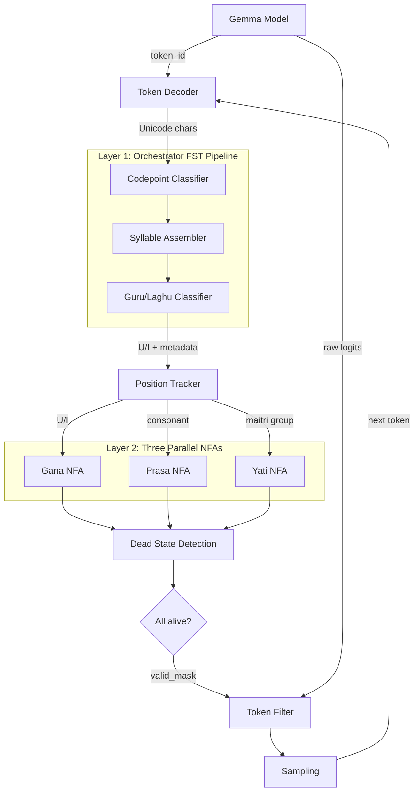
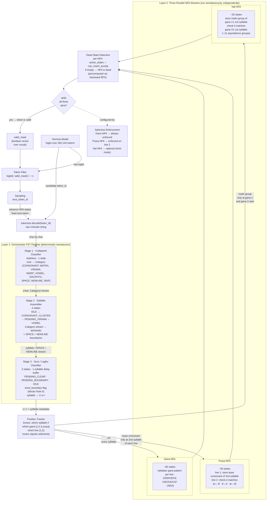
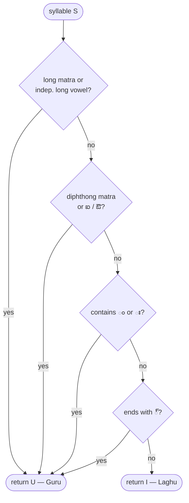

# Phase 6: Constrained Decoding — FST+NFA Architecture for Telugu Dwipada Generation

## Context

Phases 1–3 established a validated corpus of **29,343** Telugu dwipada couplets with 100% prosodic integrity (Level 1 chandass scan). However, when a language model such as Gemma generates Telugu text, it has no built-in awareness of dwipada metre — gana sequences, prasa rhyme, or yati alliteration are not learned reliably from pre-training data alone.

This phase designs a **constrained decoding** system that intercepts Gemma's token generation at every step and masks out any token that would violate dwipada metre. The architecture is a **three-stage Finite State Transducer (FST) pipeline** feeding **three parallel Non-deterministic Finite Automata (NFAs)**, each enforcing one prosodic constraint independently. Together, they guarantee that every generated couplet is metrically valid — by construction, not by post-hoc filtering.

The key theoretical claim underpinning this design is that **dwipada validation is a regular language**: all constraints involve fixed-length patterns over finite alphabets with bounded comparisons. No stack, tape, or unbounded memory is required — finite automata suffice.

---

## 1. Theoretical Foundation

### 1.1 Dwipada Constraints and the Chomsky Hierarchy

Every dwipada constraint operates on fixed positions with finite alphabets:

| Constraint | What It Checks | Alphabet | Positions | Memory Needed |
|-----------|---------------|----------|-----------|---------------|
| **Gana pattern** | U/I sequence matches `(Indra)³·(Surya)` | {U, I} | Every syllable | Pattern progress (finite) |
| **Prasa** | 2nd syllable consonant of line 1 = line 2 | ~30 consonant classes | 2 fixed positions | 1 stored class (finite) |
| **Yati** | 1st letter of gana 1 = gana 3 (same line) | ~11 maitri groups | 2 fixed positions | 1 stored group (finite) |

None of these require unbounded counting, recursive nesting, or arbitrary computation:

| Machine | Memory | Needed For | Required for Dwipada? |
|---------|--------|-----------|----------------------|
| **Finite Automaton (DFA/NFA)** | Finite states only | Fixed patterns, bounded comparisons | **Yes — sufficient** |
| Pushdown Automaton (PDA) | Unbounded stack | Nested matching (a^n b^n) | No — unnecessary |
| Turing Machine | Infinite tape | Arbitrary computation | No — overkill |

### 1.2 Formal Language

The gana pattern for a single line (pada) is:

```
L_line = (IIII | IIIU | IIUI | UII | UIU | UUI)³ · (III | UI)
```

A full dwipada (two lines): `L_dwipada = L_line · L_line` — a finite union of concatenations of finite strings, trivially regular.

Adding prasa and yati multiplies the state space by bounded constants (~30 consonant classes, ~11 maitri groups) but preserves regularity. Regular languages are closed under intersection and inverse homomorphism, so the combined machine remains an NFA.

---

## 2. System Architecture Overview

The architecture has two layers:

- **Layer 1 — Orchestrator FST Pipeline**: Three chained Finite State Transducers that transform raw Unicode text into a classified U/I syllable stream. This is pure data transformation — no acceptance or rejection.
- **Layer 2 — Position Tracker + Three Parallel NFAs**: Routes signals from the U/I stream to three independent NFAs that validate gana patterns, prasa rhyme, and yati alliteration simultaneously.

### 2.1 Architecture Diagram



### 2.2 Detailed Architecture Diagram



### 2.3 Signal Routing

The Position Tracker is the router — it knows exactly which syllable of which gana of which line is being processed, and selectively forwards signals:

| Signal | From | To | When |
|--------|------|----|------|
| U / I marker | Guru/Laghu FST | **Gana NFA** | Every syllable |
| Base consonant class | Syllable metadata | **Prasa NFA** | 2nd syllable of line 1 and line 2 only |
| Maitri group | Syllable metadata | **Yati NFA** | 1st syllable of gana 1 and gana 3 only |

---

## 3. Layer 1: Orchestrator FST Pipeline

### 3.1 Stage 1: Codepoint Classifier FST

A stateless Mealy transducer that classifies each Unicode character into a linguistic category. It has a single universal state `q0` that loops on every input.

**Categories:**

| Category | Symbol | Codepoint Range | Examples |
|----------|--------|----------------|----------|
| CONSONANT | C | U+0C15–U+0C39 | క ఖ గ ... హ ళ ఱ |
| INDEPENDENT_V | V | U+0C05–U+0C14 | అ ఆ ఇ ఈ ఉ ఊ ఋ ఎ ఏ ఐ ఒ ఓ ఔ |
| MATRA | M | U+0C3E–U+0C4C | ా ి ీ ు ూ ృ ె ే ై ొ ో ౌ |
| VIRAMA | V̄ | U+0C4D | ్ |
| ANUSVARA | A | U+0C02 | ం |
| VISARGA | VS | U+0C03 | ః |
| AI_LENGTH | AL | U+0C56 | ౖ |
| SPACE | SP | U+0020 | `' '` |
| NEWLINE | NL | U+000A | `'\n'` |
| ZWNJ | ZW | U+200C | (invisible) |
| OTHER | OT | anything else | digits, punctuation |

**Worked example:** `"నమస్కారం"`

| Position | Char | Codepoint | Category |
|---------:|------|-----------|----------|
| 0 | న | U+0C28 | CONSONANT |
| 1 | మ | U+0C2E | CONSONANT |
| 2 | స | U+0C38 | CONSONANT |
| 3 | ్ | U+0C4D | VIRAMA |
| 4 | క | U+0C15 | CONSONANT |
| 5 | ా | U+0C3E | MATRA |
| 6 | ర | U+0C30 | CONSONANT |
| 7 | ం | U+0C02 | ANUSVARA |

| Property | Value |
|----------|-------|
| Machine type | Mealy FST (stateless transducer) |
| States | 1 |
| Transition function | Range lookup table, O(1) per codepoint |
| Memory | None |

---

### 3.2 Stage 2: Syllable Assembler FST

Groups the classified character stream into complete Telugu syllables (aksharalu). Handles conjunct consonants, trailing virama (pollu) merging, and boundary pass-through.

**States:**

| State | Description |
|-------|-------------|
| `IDLE` | No syllable buffer active. Clean slate. |
| `CONSONANT_CLUSTER` | Buffer holds C(్C)* — a consonant cluster that may grow with virama or matra. |
| `PENDING_VIRAMA` | Buffer ends with ్. Lookahead state: next consonant = conjunct, otherwise = pollu merge. |
| `VOWEL` | Buffer holds an independent vowel V, may grow with a following diacritic. |

**Hidden field:** `prev_syllable` — a one-slot buffer storing the last emitted syllable for retroactive pollu merge. This is finite-state: syllables are bounded at ~10 characters.

**State Diagram:**

```mermaid
stateDiagram-v2
    [*] --> IDLE

    IDLE --> CONSONANT_CLUSTER : CONSONANT / buffer=[C]
    IDLE --> VOWEL : INDEPENDENT_V / buffer=[V]
    IDLE --> IDLE : SPACE, NEWLINE / emit boundary
    IDLE --> IDLE : MATRA, VIRAMA, OTHER / skip

    CONSONANT_CLUSTER --> PENDING_VIRAMA : VIRAMA / buffer += [్]
    CONSONANT_CLUSTER --> IDLE : MATRA, DIACRITIC / buffer += [M]; emit syllable
    CONSONANT_CLUSTER --> CONSONANT_CLUSTER : CONSONANT / emit syllable; buffer=[C]
    CONSONANT_CLUSTER --> VOWEL : INDEPENDENT_V / emit syllable; buffer=[V]
    CONSONANT_CLUSTER --> IDLE : SPACE, NEWLINE / emit syllable; emit boundary

    PENDING_VIRAMA --> CONSONANT_CLUSTER : CONSONANT / conjunct confirmed; buffer += [C]
    PENDING_VIRAMA --> IDLE : MATRA, DIACRITIC / buffer += [M]; emit syllable
    PENDING_VIRAMA --> IDLE : SPACE, NEWLINE / POLLU MERGE; emit boundary
    PENDING_VIRAMA --> VOWEL : INDEPENDENT_V / POLLU MERGE; buffer=[V]

    VOWEL --> IDLE : DIACRITIC / buffer += [D]; emit syllable
    VOWEL --> CONSONANT_CLUSTER : CONSONANT / emit syllable; buffer=[C]
    VOWEL --> VOWEL : INDEPENDENT_V / emit syllable; buffer=[V]
    VOWEL --> IDLE : SPACE, NEWLINE / emit syllable; emit boundary

    CONSONANT_CLUSTER --> [*] : END / emit syllable
    PENDING_VIRAMA --> [*] : END / POLLU MERGE
    VOWEL --> [*] : END / emit syllable
    IDLE --> [*] : END
```



**Key mechanisms:**

- **Conjunct handling:** When `PENDING_VIRAMA` sees another `CONSONANT`, the virama was a conjunct marker (e.g., స + ్ + క → స్క). The cluster extends.
- **Pollu merge:** When `PENDING_VIRAMA` sees a non-consonant (space, newline, end), the trailing virama (్) is a pollu — it merges backward into `prev_syllable` (e.g., "సె" + "న్" → "సెన్").

**Worked examples:**

| Input | Output Syllables |
|-------|-----------------|
| `"నమస్కారం"` | ["న", "మ", "స్కా", "రం"] |
| `"పూసెన్"` | ["పూ", "సెన్"] (pollu merged) |
| `"తెలుగు భాష"` | ["తె", "లు", "గు", " ", "భా", "ష"] |
| `"స్త్రీ"` | ["స్త్రీ"] (triple conjunct) |

| Property | Value |
|----------|-------|
| Machine type | Mealy FST (stateful transducer) |
| States | 4 |
| Extra memory | current buffer (~10 chars) + prev_syllable (~10 chars) |
| Input alphabet | Category enum (11 values) |
| Output alphabet | Telugu syllable strings + {SPACE, NEWLINE} |

---

### 3.3 Stage 3: Guru/Laghu Classifier FST

Classifies each syllable as **Guru (U)** or **Laghu (I)** using 5 prosody rules from classical Telugu chandassu. Uses a 1-syllable delay buffer to handle Rule 5 (sandhi lookahead).

**The 5 Guru Classification Rules:**

| Rule | Name (Telugu) | Condition | Example |
|------|--------------|-----------|---------|
| 1 | దీర్ఘ స్వరం (Long vowel) | Contains long matra ా ీ ూ ే ో ౌ ౄ, or independent long vowel ఆ ఈ ఊ ౠ ఏ ఓ | రా = U |
| 2 | సంధ్యక్షరం (Diphthong) | Contains diphthong matra ై ౌ, or independent diphthong ఐ ఔ | గై = U |
| 3 | అనుస్వారం/విసర్గ | Contains anusvara ం or visarga ః | సం = U |
| 4 | పొల్లు హల్లు (Trailing virama) | Syllable ends with ్ (halant) | న్ = U |
| 5 | సంధి (Sandhi lookahead) | NEXT syllable (same word) starts with conjunct C+్+C | స + త్య → స = U |
| — | Default (లఘువు) | None of the above | క = I |

Rules 1–4 are evaluated by a stateless function `classify_self(syllable)`:



**Rule 5 — Word boundary suppression:**

Rule 5 fires only within the same word. A space between syllables blocks it:

```
Same word:      స + త్య    →  స = U   (Rule 5 fires)
Across space:   స + ' ' + త్య  →  స = I   (Rule 5 blocked by space)
Across newline: స + '\n' + త్య  →  స = U   (newline is transparent)
```

**FST States:**

| State | Description |
|-------|-------------|
| `IDLE` | No pending syllable. |
| `PENDING_CLEAR` | One syllable buffered, no word boundary seen since. Rule 5 may fire. |
| `PENDING_BOUNDARY` | One syllable buffered, space encountered. Rule 5 blocked. |

**Transition Table:**

| From | Input | Action | Next State |
|------|-------|--------|------------|
| IDLE | syllable S | buffer(S); self_class = classify_self(S) | PENDING_CLEAR |
| IDLE | space / newline | emit(boundary) | IDLE |
| PENDING_CLEAR | syllable S2 | if conjunct_start(S2): **emit U** (Rule 5); else: emit self_class(P); buffer(S2) | PENDING_CLEAR |
| PENDING_CLEAR | space / newline | buffer_boundary | PENDING_BOUNDARY |
| PENDING_BOUNDARY | syllable S2 | emit self_class(P); emit_boundaries(); buffer(S2) | PENDING_CLEAR |
| PENDING_BOUNDARY | space / newline | buffer_boundary | PENDING_BOUNDARY |
| PENDING_CLEAR | FLUSH | emit self_class(P) | IDLE |
| PENDING_BOUNDARY | FLUSH | emit self_class(P); emit_boundaries() | IDLE |

**Worked example:** `"తనుమ ళ్ళరాస్తుంది"`

| Step | Input | State Before | Pending | Rule 5 | Emitted |
|-----:|-------|-------------|---------|--------|---------|
| 1 | తు | IDLE | — | — | — |
| 2 | ను | PENDING_CLEAR | తు=I | no | I |
| 3 | మ | PENDING_CLEAR | ను=I | no | I |
| 4 | ' ' | PENDING_CLEAR | మ=I | — | — |
| 5 | ళ్ళ | PENDING_BOUNDARY | మ=I | BLOCKED | I, ' ' |
| 6 | రా | PENDING_CLEAR | ళ్ళ=I | no | I |
| 7 | స్తుం | PENDING_CLEAR | రా=U | no | U |
| 8 | ది | PENDING_CLEAR | స్తుం=U | no | U |
| FLUSH | — | PENDING_CLEAR | ది=I | — | I |

Output (syllable markers only): **I I I I U U I**

| Property | Value |
|----------|-------|
| Machine type | Mealy FST (stateful transducer) |
| States | 3 (IDLE, PENDING_CLEAR, PENDING_BOUNDARY) |
| Extra memory | 1 pending syllable + self_class |
| Key feature | 1-syllable delay buffer for Rule 5 lookahead |

---

## 4. Layer 2: Position Tracker and Three Parallel NFAs

### 4.1 Position Tracker

The Position Tracker sits between the FST pipeline and the three NFAs. It maintains:

- **Current line** — 1 or 2
- **Current gana index** — 1, 2, 3, or Surya
- **Current syllable within gana** — 0, 1, 2, 3

Based on position, it selectively routes different signals to different NFAs. The Gana NFA receives every U/I marker. The Prasa NFA receives a consonant class only at the 2nd syllable of each line. The Yati NFA receives a maitri group only at the start of gana 1 and gana 3.

### 4.2 Gana Pattern NFA (~60 states)

Validates the metrical gana structure of each line. Each line must consist of exactly three Indra ganas followed by one Surya gana.

**Indra Ganas (ఇంద్ర గణములు) — 6 types, each 3–4 syllables:**

| Gana | Telugu Name | Pattern | Syllables |
|------|------------|---------|----------:|
| Nala | నల | IIII | 4 |
| Naga | నగ | IIIU | 4 |
| Sala | సల | IIUI | 4 |
| Bha | భ | UII | 3 |
| Ra | ర | UIU | 3 |
| Ta | త | UUI | 3 |

**Surya Ganas (సూర్య గణములు) — 2 types:**

| Gana | Telugu Name | Pattern | Syllables |
|------|------------|---------|----------:|
| Na | న | III | 3 |
| Ha/Gala | హ / గల | UI | 2 |

**Formal language per line:**

```
L_line = (IIII | IIIU | IIUI | UII | UIU | UUI)³ · (III | UI)
```

**How the NFA works:**

The NFA non-deterministically guesses which gana pattern is being read. After the first syllable:
- On `I` → could be Nala, Naga, or Sala (need more symbols)
- On `U` → could be Bha, Ra, or Ta

With 4 gana slots x ~4 sub-states x 6 branches (or 2 for Surya), the NFA for one line has roughly **50–70 states**. Dead state detection (Section 5) prunes impossible branches after each symbol.

### 4.3 Prasa Rhyme NFA (~35 states)

Enforces the prasa (ప్రాస) constraint: the base consonant of the **2nd syllable** of line 1 must match the base consonant of the 2nd syllable of line 2.

**Two-phase operation:**

| Phase | Line | Action |
|-------|------|--------|
| Phase 1 | Line 1 | At 2nd syllable: record the base consonant's equivalence class. Any class is valid. |
| Phase 2 | Line 2 | At 2nd syllable: verify consonant matches stored class. Mismatch → dead. |

**Prasa Equivalence Groups (ప్రాస సమానాక్షరములు):**

Consonants in each group are treated as equivalent for prasa matching:

| Group | Consonants | Phonetic Basis |
|-------|-----------|---------------|
| 1 | {ల, ళ} | Laterals |
| 2 | {శ, స} | Sibilants |
| 3 | {ఱ, ర} | Rhotals |

All other consonants (~30 remaining) form singleton equivalence classes. State count: ~30 classes x 2 phases + control states ≈ **~35 states**.

### 4.4 Yati Alliteration NFA (~28 states)

Enforces the yati (యతి) constraint: the 1st letter of **gana 1** must match the 1st letter of **gana 3** within the same line, under Yati Maitri group equivalence.

**Yati Maitri Groups (యతి మైత్రి వర్గములు) — 11 groups:**

| # | Group Members | Phonetic Basis |
|--:|--------------|----------------|
| 1 | {అ, ఆ, ఐ, ఔ, హ, య, అం, అః} | Open vowels + glides |
| 2 | {ఇ, ఈ, ఎ, ఏ, ఋ} | Front vowels |
| 3 | {ఉ, ఊ, ఒ, ఓ} | Back vowels |
| 4 | {క, ఖ, గ, ఘ, క్ష} | Velars (కంఠ్యము) |
| 5 | {చ, ఛ, జ, ఝ, శ, ష, స} | Palatals + Sibilants (తాలవ్యము) |
| 6 | {ట, ఠ, డ, ఢ} | Retroflexes (మూర్ధన్యము) |
| 7 | {త, థ, ద, ధ} | Dentals (దంత్యము) |
| 8 | {ప, ఫ, బ, భ, వ} | Labials (ఓష్ఠ్యము) |
| 9 | {ర, ల, ఱ, ళ} | Liquids |
| 10 | {న, ణ} | Nasals |
| 11 | {మ, పు, ఫు, బు, భు, ము} | Labial nasals |

**Three-phase operation per line:**

| Phase | Position | Action |
|-------|----------|--------|
| Recording | Gana 1, 1st syllable | Store the maitri group of the 1st consonant/vowel |
| Pass-through | Gana 2 | No action |
| Checking | Gana 3, 1st syllable | Verify maitri group matches stored group |

State count: ~11 groups x 3 phases + control states ≈ **~28 states**.

**Selective enforcement:** Yati enforcement is optional (strict mode). In relaxed mode, only Gana and Prasa NFAs are active.

---

## 5. Dead State Detection

### 5.1 Two Kinds of Dead States

**Immediately dead:** The NFA's active state set is empty — no branch survived the last transition.

**Eventually dead (doomed):** The NFA has active states, but no path from any of them can reach an accept state. Examples:
- Gana NFA: 14 syllables consumed but still in gana 3 — the line will overshoot the maximum of 15 syllables
- Prasa NFA: line 2's 2nd syllable has mismatched consonant — no future input can fix this
- Yati NFA: gana 3's 1st letter doesn't match gana 1 — permanently doomed

### 5.2 Precomputed Co-Reachability

For each NFA, precompute via backward BFS from accept states which states can reach acceptance:

```python
# One-time precomputation
can_reach_accept = set(accept_states)
queue = list(accept_states)
while queue:
    state = queue.pop()
    for pred in reverse_transitions[state]:
        if pred not in can_reach_accept:
            can_reach_accept.add(pred)
            queue.append(pred)

# At runtime — O(1) per state:
active_states = nfa.advance(active_states, symbol)
active_states &= can_reach_accept        # prune doomed branches
if len(active_states) == 0:
    # Truly dead — no hope
```

| Dead Type | Detection | Runtime Cost |
|-----------|-----------|-------------|
| Immediate (empty set) | `len(active) == 0` | O(1) |
| Doomed (alive but hopeless) | `active & can_reach_accept == ∅` | O(1) per state |

The `can_reach_accept` set is precomputed once — at runtime it is a set intersection.

---

## 6. Constrained Decoding Loop

### 6.1 Core Loop

At each generation step, the system evaluates every candidate token through the full FST+NFA pipeline:

```python
for each generation step:
    logits     = gemma.forward(input_ids)          # model output
    valid_mask = get_valid_tokens(nfa_states)       # AND of all 3 NFAs
    logits[~valid_mask] = float('-inf')             # kill invalid tokens
    next_token = sample(logits)                     # sample from valid only
    nfa_states = advance(nfa_states, next_token)    # update all 3 NFA states
```

### 6.2 Token Evaluation

For each candidate token, the evaluation proceeds:

1. Decode the token to a Unicode string
2. Feed each codepoint through Stage 1 (classify) → Stage 2 (assemble syllables) → Stage 3 (classify U/I)
3. Route U/I markers and syllable metadata through the Position Tracker to all three NFAs
4. After all codepoints: check if all three NFAs remain alive
5. If any NFA is dead → mark the token as invalid

### 6.3 Selective Enforcement

```python
valid_mask = gana_mask                           # always enforce
if on_line_2:
    valid_mask &= prasa_mask                     # enforce rhyme on line 2
if strict_yati:
    valid_mask &= yati_mask                      # optionally enforce
```

---

## 7. Design Decisions

| Decision | Chosen Approach | Alternative | Rationale |
|----------|----------------|-------------|-----------|
| **3 separate NFAs** | ~123 total states | Product automaton: ~58,800 states (60 x 35 x 28) | Debuggability — know which rule failed. Partial scoring — gana 40%, prasa 35%, yati 25%. Selective enforcement — can relax yati independently. |
| **Codepoint-level input** | ~8 FST states | Token-level: ~100 fragment-buffer states | Handles BPE token misalignment naturally. Fixed ~130 character alphabet vs ~5K variable-length Telugu tokens. |
| **NFA (not DFA)** for Gana | Natural branching | DFA via subset construction | NFA directly expresses the "guess which gana" pattern. Smaller representation. Subset construction would explode state count. |
| **1-syllable delay buffer** | 3 states | Full lookahead window | Minimal state sufficient for Rule 5. No stack or tape required. |
| **Word boundary tracking** | space flag in FST | Ignore word boundaries | Poets control word breaks as a metrical tool. Same syllable can be U or I depending on the next word. Essential for accurate constrained decoding. |

### Prior Art

This approach builds on proven constrained decoding frameworks:
- **Outlines** (dottxt-ai) — FSM-based JSON/regex-constrained generation
- **guidance** (Microsoft) — grammar-constrained LLM decoding
- **LMQL** — query language with LLM output constraints

The novelty is applying constrained decoding to **Telugu poetic metre** using prosody-specific NFAs — a domain where linguistic constraints are naturally regular.

---

## 8. State Budget Summary

| Component | Type | States | Input | Output |
|-----------|------|-------:|-------|--------|
| Codepoint Classifier | Mealy FST | 1 | Unicode codepoint | (char, Category) |
| Syllable Assembler | Mealy FST | 4 | Category stream | aksharalu stream |
| Guru/Laghu Classifier | Mealy FST | 3 | aksharalu stream | U/I stream |
| Position Tracker | Controller | ~4 | U/I + metadata | routed signals |
| Gana NFA | NFA (acceptor) | ~60 | U/I markers | alive / dead |
| Prasa NFA | NFA (acceptor) | ~35 | consonant class | alive / dead |
| Yati NFA | NFA (acceptor) | ~28 | maitri group | alive / dead |
| **Total** | | **~135** | | |

Compared to a single product automaton (60 x 35 x 28 = **~58,800 states**), the separate-NFA design achieves a **435x reduction** in state count while preserving full validation capability.

---

## 9. Implementation Status

| Component | File | Status |
|-----------|------|--------|
| Codepoint Classifier | `nfa_for_dwipada/syllable_assembler.py` (integrated) | Implemented |
| Syllable Assembler | `nfa_for_dwipada/syllable_assembler.py` | Implemented |
| Guru/Laghu Classifier | `nfa_for_dwipada/guru_laghu_classifier.py`, `nfa_for_dwipada/ganana_marker.py` | Implemented |
| Gana NFA | — | Design complete |
| Prasa NFA | — | Design complete |
| Yati NFA | — | Design complete |
| Position Tracker | — | Design complete |
| Constrained Decode Loop | — | Design complete |
| Ground-truth Analyzer | `src/dwipada/core/analyzer.py` | Implemented (reference) |

---

## Conclusion

1. **Dwipada validation is a regular language** — all constraints (gana patterns, prasa rhyme, yati alliteration) involve fixed-length patterns over finite alphabets with bounded comparisons. No pushdown automaton or Turing machine is required.
2. **The three-stage FST pipeline** (Codepoint Classifier → Syllable Assembler → Guru/Laghu Classifier) solves the Unicode-to-prosody transformation cleanly, handling conjuncts, pollu merging, and word boundary tracking with only 8 states total.
3. **Three parallel NFAs** enforce gana, prasa, and yati independently with a combined state budget of ~123 states — a **435x reduction** over the product automaton alternative — while enabling debuggability, partial scoring, and selective enforcement.
4. **Dead state detection** via precomputed co-reachability ensures aggressive pruning at O(1) cost per state, preventing exponential branch explosion.
5. **The constrained decoding loop** integrates with Gemma's generation process, masking invalid tokens at each step to guarantee metrically valid output by construction — not by post-hoc filtering.

*Architecture design completed 2026-03-08.*
